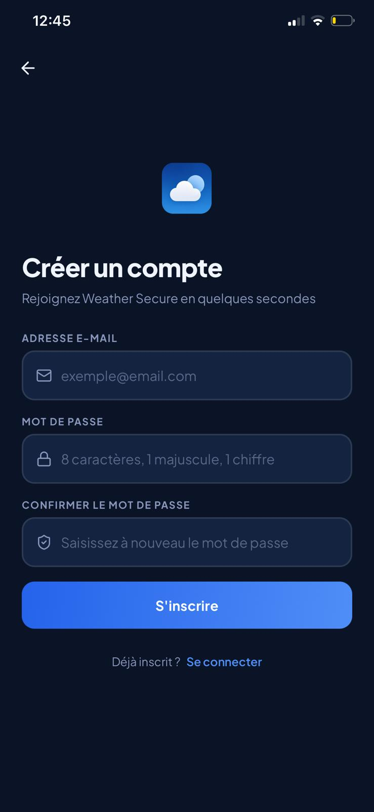
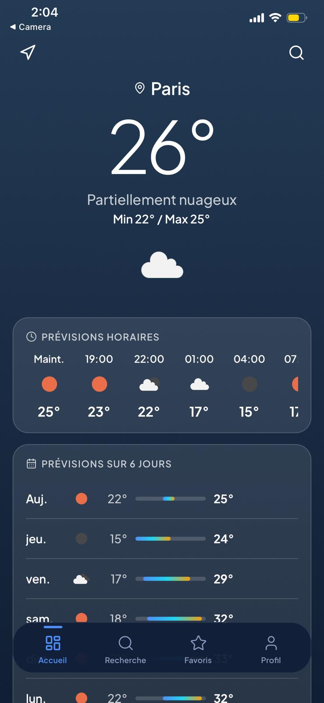
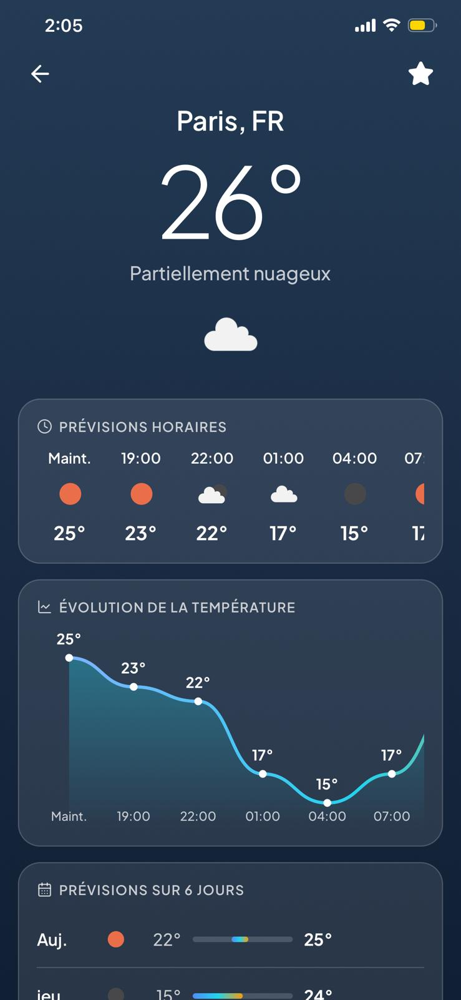
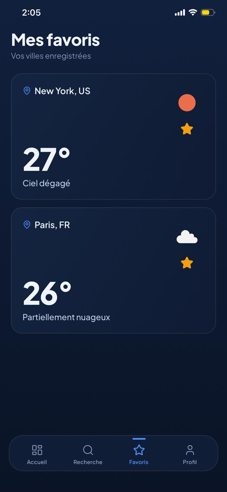

# Weather Secure App

Application mobile **React Native / Expo** d'interrogation de l'API **OpenWeather**, avec
authentification sécurisée **Firebase**, stockage local **SQLite**, validation avancée
des formulaires avec **Joi** et retour haptique.

<p align="center">
  
  
  
  
</p>
<p align="center">
  
  
  
  
  
</p>
<p align="center">
  
  = 18" />
  
</p>

---

## Sommaire

- [Captures d'écran](#captures-décran)
- [Fonctionnalités](#fonctionnalités)
- [Pile technique](#pile-technique)
- [Prérequis](#prérequis)
- [Installation](#installation)
- [Variables d'environnement](#variables-denvironnement)
- [Configuration Firebase](#configuration-firebase)
- [Configuration OpenWeather](#configuration-openweather)
- [Lancement](#lancement)
- [Architecture du projet](#architecture-du-projet)
- [Écrans](#écrans)
- [Composants réutilisables](#composants-réutilisables)
- [Sécurité des formulaires (Joi)](#sécurité-des-formulaires-joi)
- [Gestion des données (Firebase et SQLite)](#gestion-des-données-firebase-et-sqlite)
- [Navigation et protection des routes](#navigation-et-protection-des-routes)
- [Bonus implémentés](#bonus-implémentés)
- [Auteur](#auteur)

---

## Captures d'écran

### Authentification

<p align="center">
  
  
  
</p>

### Application

<p align="center">
  
  
  
</p>
<p align="center">
  
  
</p>

---

## Fonctionnalités

| Domaine | Détail |
|---|---|
| **Authentification** | Inscription, connexion, déconnexion, réinitialisation de mot de passe |
| **Météo actuelle** | Recherche par ville ou géolocalisation, température, ressenti, humidité, vent, pression, visibilité, lever/coucher de soleil |
| **Prévisions** | Barres de température horaires défilantes + résumé multi-jours |
| **Favoris** | Ajout / suppression de villes, synchronisés entre SQLite et Firestore |
| **Historique** | Dernières recherches enregistrées localement par utilisateur |
| **Navigation protégée** | Les écrans applicatifs sont inaccessibles sans session active |
| **Mode sombre** | Bascule claire/sombre persistée entre les sessions |
| **Retour haptique** | Vibrations légères au toucher et à la validation |

---

## Pile technique

| Couche | Outil / Bibliothèque | Version |
|---|---|---|
| Framework mobile | React Native (Expo) | 0.81.5 / SDK 54 |
| UI | React | 19.1 |
| Authentification | Firebase Authentication | 11.x |
| Base de données distante | Cloud Firestore | 11.x |
| Stockage local | expo-sqlite | ~16.0 |
| Persistance de session | @react-native-async-storage/async-storage | 2.2 |
| Validation des formulaires | Joi | 17.x |
| Navigation | React Navigation (Native Stack + Bottom Tabs) | 7.x |
| Icônes | lucide-react-native | 1.x |
| Graphiques | react-native-gifted-charts | 1.x |
| Géolocalisation | expo-location | ~19.0 |
| Retour haptique | expo-haptics | — |
| Polices | @expo-google-fonts/plus-jakarta-sans | — |
| Requêtes HTTP | Fetch (natif) | — |

---

## Prérequis

- **Node.js** 18 ou supérieur
- **npm** (inclus avec Node.js)
- L'application **Expo Go** installée sur votre téléphone (iOS ou Android)
- Un compte **Firebase** 
- Un compte **OpenWeatherMap** 

---

## Installation

```bash
git clone <url-du-depot>
cd weather-secure-app
npm install
```

Copiez ensuite le fichier d'exemple des variables d'environnement :

```bash
cp .env.example .env
```

Puis renseignez vos clés dans `.env` (voir sections suivantes).

---

## Variables d'environnement

Le fichier `.env` doit contenir les huit variables suivantes :

```env
# Clé API OpenWeather (https://openweathermap.org/api)
EXPO_PUBLIC_OPENWEATHER_KEY=votre_cle_openweather

# Configuration Firebase (console > Paramètres du projet > Vos applications)
EXPO_PUBLIC_FIREBASE_API_KEY=votre_api_key
EXPO_PUBLIC_FIREBASE_AUTH_DOMAIN=votre_projet.firebaseapp.com
EXPO_PUBLIC_FIREBASE_PROJECT_ID=votre_projet
EXPO_PUBLIC_FIREBASE_STORAGE_BUCKET=votre_projet.appspot.com
EXPO_PUBLIC_FIREBASE_MESSAGING_SENDER_ID=000000000000
EXPO_PUBLIC_FIREBASE_APP_ID=1:000000000000:web:xxxxxxxxxxxx
```

> **Important** — Les variables sont préfixées `EXPO_PUBLIC_` afin d'être accessibles
> côté client via le mécanisme natif d'Expo. Le fichier `.env` ne doit jamais être versionné.

---

## Configuration Firebase

1. Créez un projet sur [console.firebase.google.com](https://console.firebase.google.com/).
2. Ajoutez une application **Web** (`</>`) et récupérez l'objet `firebaseConfig`.
3. Dans **Authentication > Sign-in method**, activez **Adresse e-mail / Mot de passe**.
4. Dans **Firestore Database**, créez une base en mode production ou test pour activer
   la synchronisation des favoris.
5. Renseignez les variables `EXPO_PUBLIC_FIREBASE_*` dans le fichier `.env`.

---

## Configuration OpenWeather

1. Créez un compte sur [openweathermap.org](https://openweathermap.org/).
2. Récupérez votre clé API dans la section **API keys** de votre tableau de bord.
3. Renseignez la variable `EXPO_PUBLIC_OPENWEATHER_KEY` dans le fichier `.env`.

> La clé peut nécessiter quelques minutes après sa création avant d'être active.
> L'API utilisée est **Current Weather Data** + **5 Day / 3 Hour Forecast** (plan gratuit).

---

## Lancement

```bash
npm start
```

Scannez le QR code affiché dans le terminal avec l'application **Expo Go**.

Pour cibler directement une plateforme :

```bash
npm run ios       # Simulateur iOS
npm run android   # Émulateur Android
npm run web       # Navigateur web
```

---

## Architecture du projet

```
weather-secure-app/
├── assets/                  Icône et logo de l'application
├── captures/                Captures d'écran pour le README
├── src/
│   ├── config/
│   │   ├── env.js           Lecture et exposition des variables d'environnement
│   │   └── firebaseClient.js Initialisation du SDK Firebase
│   ├── context/
│   │   ├── SessionContext.jsx  État de la session (utilisateur connecté)
│   │   └── ThemeContext.jsx    Thème clair / sombre global
│   ├── navigation/
│   │   ├── RootNavigator.jsx   Aiguillage public ↔ privé selon la session
│   │   ├── AuthNavigator.jsx   Pile d'écrans d'authentification
│   │   ├── AppNavigator.jsx    Navigation principale (tabs + stack)
│   │   └── MainTabsNavigator.jsx Barre d'onglets du bas
│   ├── screens/
│   │   ├── ConnexionScreen.jsx
│   │   ├── InscriptionScreen.jsx
│   │   ├── MotDePasseOublieScreen.jsx
│   │   ├── TableauBordScreen.jsx
│   │   ├── RechercheScreen.jsx
│   │   ├── DetailMeteoScreen.jsx
│   │   ├── FavorisScreen.jsx
│   │   └── ProfilScreen.jsx
│   ├── components/
│   │   ├── BoutonPrincipal.jsx      Bouton CTA avec état de chargement
│   │   ├── CarteInfo.jsx            Tuile d'information météo (humidité, vent…)
│   │   ├── CarteMeteo.jsx           Carte résumée d'une ville
│   │   ├── CarteVerre.jsx           Conteneur glassmorphism réutilisable
│   │   ├── ChampTexte.jsx           Champ de saisie avec affichage d'erreur
│   │   ├── GraphiqueTemperature.jsx Barres de température multi-jours
│   │   ├── IndicateurChargement.jsx Spinner + message de chargement
│   │   ├── MessageErreur.jsx        Bloc d'erreur stylisé
│   │   ├── PrevisionHoraire.jsx     Tuile de prévision horaire (défilante)
│   │   └── PrevisionJournaliere.jsx Ligne de prévision journalière
│   ├── services/
│   │   ├── authService.js     Inscription, connexion, déconnexion, reset mdp
│   │   └── meteoService.js    Appels OpenWeather + cache mémoire 10 min
│   ├── database/
│   │   ├── sqliteClient.js        Ouverture de la base et création des tables
│   │   ├── historiqueRepository.js CRUD historique des recherches
│   │   └── favorisRepository.js   CRUD favoris locaux
│   ├── validation/
│   │   ├── schemaConnexion.js   Schéma Joi : e-mail + mot de passe
│   │   ├── schemaInscription.js Schéma Joi : e-mail, mot de passe fort, confirmation
│   │   └── schemaRecherche.js   Schéma Joi : nom de ville (2 caractères min.)
│   ├── hooks/
│   │   └── useHaptic.js         Retours haptiques (light, success, error)
│   ├── utils/
│   │   ├── agregerPrevisions.js      Regroupement des prévisions 3h par jour
│   │   ├── formatMeteo.js            Formatage des dates, températures, icônes
│   │   ├── messagesErreurFirebase.js Traduction des codes d'erreur Firebase
│   │   └── validerFormulaire.js      Exécution d'un schéma Joi et collecte des erreurs
│   └── theme/
│       ├── colors.js     Palettes clair et sombre
│       ├── fonts.js      Configuration des polices (Plus Jakarta Sans)
│       └── cielMeteo.js  Dégradés de ciel selon les conditions météo
├── App.js                Point d'entrée : chargement des polices et initialisation SQLite
├── app.json              Configuration Expo (icône, splash, permissions)
├── babel.config.js       Preset Babel (babel-preset-expo)
├── metro.config.js       Configuration Metro (profil de transformation Babel)
├── .env                  Variables d'environnement (non versionné)
└── .env.example          Modèle des variables d'environnement
```

---

## Écrans

| # | Écran | Zone | Description |
|---|---|---|---|
| 1 | `ConnexionScreen` | Publique | Formulaire e-mail / mot de passe avec validation Joi |
| 2 | `InscriptionScreen` | Publique | Formulaire d'inscription avec mot de passe fort et confirmation |
| 3 | `MotDePasseOublieScreen` | Publique | Envoi d'un e-mail de réinitialisation via Firebase |
| 4 | `TableauBordScreen` | Privée | Météo de la ville par défaut ou de la position, accès rapide aux favoris |
| 5 | `RechercheScreen` | Privée | Recherche par nom de ville, résultat instantané et ajout à l'historique |
| 6 | `DetailMeteoScreen` | Privée | Détails complets, prévisions horaires et multi-jours, gestion des favoris |
| 7 | `FavorisScreen` | Privée | Liste des villes favorites (SQLite + Firestore), suppression |
| 8 | `ProfilScreen` | Privée | Informations utilisateur, bascule thème clair/sombre, déconnexion |

---

## Composants réutilisables

| Composant | Rôle |
|---|---|
| `BoutonPrincipal` | Bouton d'action principal avec indicateur de chargement intégré |
| `CarteInfo` | Tuile compacte affichant une métrique météo (icône + valeur + libellé) |
| `CarteMeteo` | Carte résumée d'une ville (température, icône, conditions) |
| `CarteVerre` | Conteneur à effet glassmorphism, utilisé comme surface de carte |
| `ChampTexte` | Champ de saisie stylisé avec affichage inline du message d'erreur Joi |
| `GraphiqueTemperature` | Diagramme à barres des températures min/max sur plusieurs jours |
| `IndicateurChargement` | Spinner animé accompagné d'un message contextuel |
| `MessageErreur` | Bloc d'erreur stylisé (fond rouge translucide) |
| `PrevisionHoraire` | Tuile horaire (heure, icône, température) dans un défilement horizontal |
| `PrevisionJournaliere` | Ligne de prévision journalière (jour, icône, min/max) |

---

## Sécurité des formulaires (Joi)

Chaque formulaire est validé côté client avec un schéma **Joi** dédié, situé dans
`src/validation/` :

| Schéma | Règles |
|---|---|
| `schemaConnexion` | E-mail RFC-5322 valide, mot de passe non vide |
| `schemaInscription` | E-mail valide, mot de passe ≥ 8 caractères avec au moins une majuscule et un chiffre, confirmation identique au mot de passe (`Joi.ref`) |
| `schemaRecherche` | Nom de ville obligatoire, 2 caractères minimum |

La fonction `validerFormulaire` (`src/utils/validerFormulaire.js`) exécute le schéma avec
`{ abortEarly: false }` pour collecter **toutes** les erreurs en un seul passage et les
renvoie regroupées par champ. Cela garantit :

- des **champs obligatoires** réellement contrôlés avant tout appel réseau,
- des **formats valides** (adresse e-mail, robustesse du mot de passe),
- des **messages d'erreur explicites** en français affichés sous chaque champ,
- une protection contre les **soumissions invalides** ou les **données incohérentes**.

Les erreurs renvoyées par Firebase (identifiants incorrects, e-mail déjà utilisé, etc.)
sont traduites en messages clairs via `src/utils/messagesErreurFirebase.js`.

---

## Gestion des données (Firebase et SQLite)

### Firebase Authentication

- `createUserWithEmailAndPassword` / `signInWithEmailAndPassword` / `signOut` /
  `sendPasswordResetEmail` exposés via `src/services/authService.js`.
- La persistance de session est assurée par **AsyncStorage**
  (`initializeAuth` + `getReactNativePersistence`) : l'utilisateur reste connecté après
  fermeture de l'application.
- L'état d'authentification est centralisé dans `SessionContext` via `onAuthStateChanged`,
  ce qui permet la **protection des routes** (un utilisateur non connecté n'accède qu'aux
  écrans d'authentification).

### Cloud Firestore

- Les favoris sont stockés dans la collection `users/{uid}/favoris`.
- Chaque document contient le nom de la ville, le pays et la date d'ajout.
- La synchronisation avec SQLite est bidirectionnelle : un favori ajouté localement est
  également écrit dans Firestore, et réciproquement au chargement de l'écran.

### SQLite (expo-sqlite)

Les données locales sont organisées en deux tables (`src/database/sqliteClient.js`) :

```sql
CREATE TABLE IF NOT EXISTS historique (
  id           INTEGER PRIMARY KEY AUTOINCREMENT,
  uid          TEXT    NOT NULL,
  ville        TEXT    NOT NULL,
  pays         TEXT,
  temperature  REAL,
  icone        TEXT,
  recherche_le INTEGER NOT NULL          -- timestamp UNIX
);

CREATE TABLE IF NOT EXISTS favoris (
  id        INTEGER PRIMARY KEY AUTOINCREMENT,
  uid       TEXT    NOT NULL,
  ville     TEXT    NOT NULL,
  pays      TEXT,
  ajoute_le INTEGER NOT NULL,
  UNIQUE (uid, ville, pays)              -- contrainte d'unicité par compte
);
```

L'accès aux données passe par des *repositories* dédiés (`historiqueRepository.js`,
`favorisRepository.js`) qui isolent les requêtes SQL du reste de l'application.
Le mode **WAL** (*Write-Ahead Logging*) est activé pour de meilleures performances en
lecture concurrente.

---

## Navigation et protection des routes

La navigation est organisée en quatre niveaux :

```
RootNavigator          ← aiguille selon useSession()
  ├── AuthNavigator    ← pile publique (Connexion → Inscription → Mot de passe oublié)
  └── AppNavigator     ← zone privée
        └── MainTabsNavigator  ← onglets (Tableau de bord · Recherche · Favoris · Profil)
              └── DetailMeteoScreen (stack au-dessus des onglets)
```

`RootNavigator` écoute `SessionContext` : dès que `onAuthStateChanged` signale une
déconnexion, l'utilisateur est renvoyé automatiquement vers `AuthNavigator` sans
intervention côté écran.

---

## Bonus implémentés

| Bonus | Implémentation |
|---|---|
| **Géolocalisation** | Météo automatique selon la position de l'appareil (`expo-location`, permission `NSLocationWhenInUseUsageDescription`) |
| **Mode sombre** | Bascule clair/sombre via `ThemeContext`, préférence persistée avec `AsyncStorage` |
| **Mise en cache améliorée** | Cache mémoire (`Map`) avec durée de validité de 10 minutes dans `meteoService.js` — réduit les appels à l'API OpenWeather |
| **Synchronisation Firebase / SQLite** | Favoris enregistrés à la fois en local (SQLite) et dans Firestore pour une cohérence multi-appareils |
| **Prévisions détaillées** | Défilement horaire (`PrevisionHoraire`) et barres de température multi-jours (`GraphiqueTemperature`, `PrevisionJournaliere`) — interface inspirée d'Apple Weather |
| **Retour haptique** | Hook `useHaptic` (light / success / error) intégré aux interactions clés via `expo-haptics` |

---

## Auteur

**Mouad BOUNOKRA**
